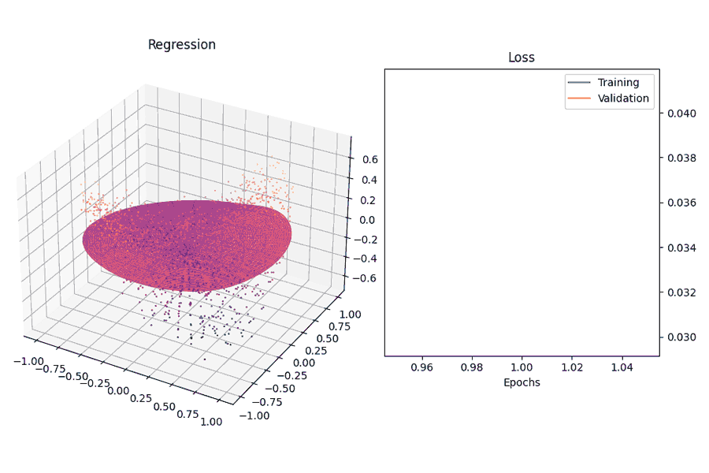

# Building a neural network from scratch

There are many libraries available for deep learning. It is relatively simple to build and implement a neural network using Tensorflow, Pytorch or scikit-learn.

However, for my first project, I decided to explore how neural networks actually learn by building it from the ground up. This project has given me a thorough understanding of the math and algorithms behind them.

This project is based on the book [Neural Networks from Scratch in Python](https://nnfs.io/).



## Content

#### Neural Network Layers

Input, dense, dropout and output layers are implemented, together with forward and backward methods. L2 regularization helps prevent overfitting.

#### Optimizers

Stochastic gradient descent, and its variations - Adagrad, RMSProp and Adam optimizers allow rapid training of the neural network, while avoiding local minimums on the error surface.
 
#### Data Visualization

The training of models can be monitored using real-time animations, including color and 3D plots.

#### Data Generation

Several functions are used to generate data to test the functionality of the program. They can easily be substituted with real world data.

## Functionality

A neural network model can be constructed and customized based on its components. The training process of the model can be evaluated with an accompanying data visualization.

For example, a classifier can be constructed as follows:

```
# The classes and their methods are found in the [Modules] folder.
# X, y, X_val, y_val are the training and validation data

# model = Model()
# model.add(Layer_Dense(2, 64, weight_regularizer_l2=5e-4, bias_regularizer_l2=5e-4))
# model.add(Activation_ReLU())
# model.add(Layer_Dense(64, 3))
# model.add(Activation_Softmax())

# visualizer = Visualizer(model=model, animate=True, X=X_val, y=y_val, n_inputs=2, n_outputs=3, colorgraph=True, validation=True)

# model.set(loss=Loss_CategoricalCrossentropy(), optimizer=Optimizer_Adam(learning_rate=0.01, decay=5e-7), accuracy=Accuracy_Categorical(), visualizer=visualizer)
# model.finalize()
# model.train(X, y, epochs=1000, validation_data=(X_val, y_val))
```
Output:


```
>>> Accuracy : 0.86333
>>> Loss     : 0.39588
```

A model was trained to classify images from the Fashion MNIST dataset.


```
Prediction  : T-shirt/top
T-shirt/top : 0.65
Trouser     : 0.08
Pullover    : 0.069
Dress       : 0.032
Coat        : 0.012
Sandal      : 0.0
Shirt       : 0.143
Sneaker     : 0.0
Bag         : 0.014
Ankle boot  : 0.0
```

## Run the project


## Credits


